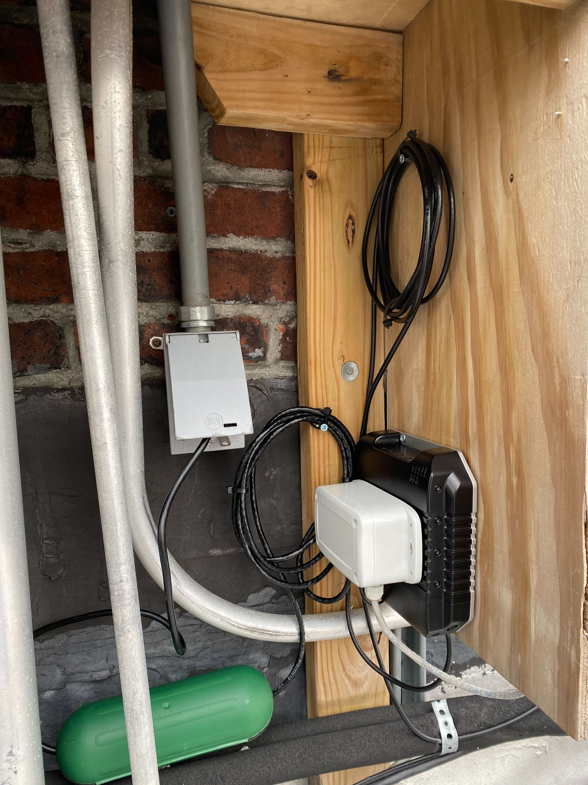
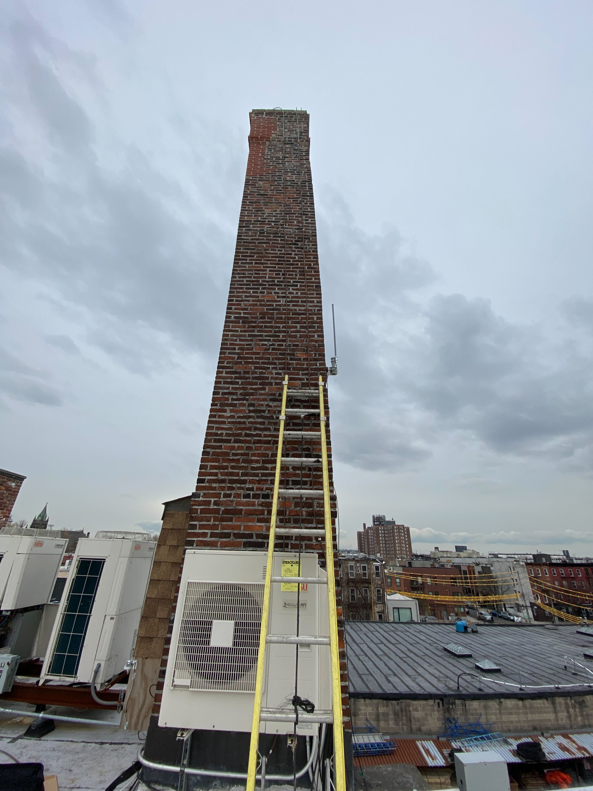
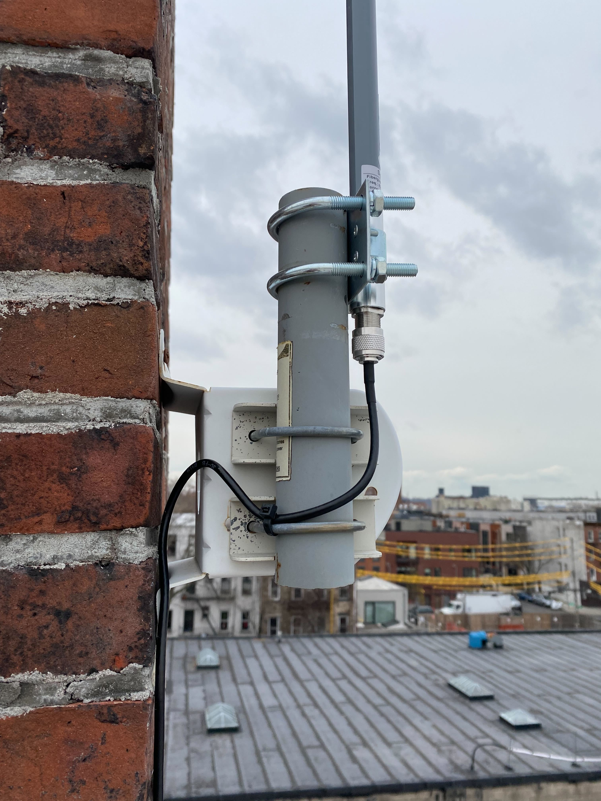
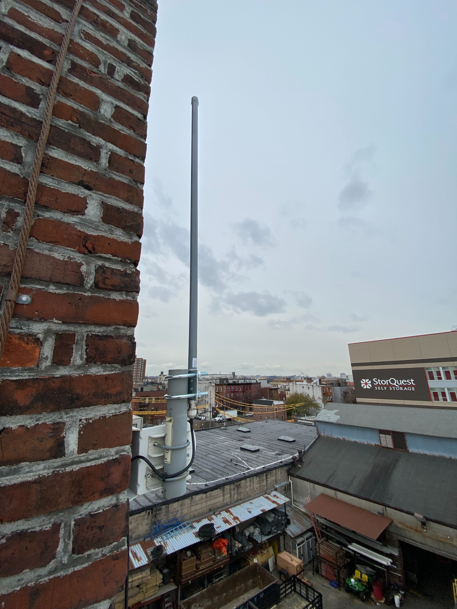
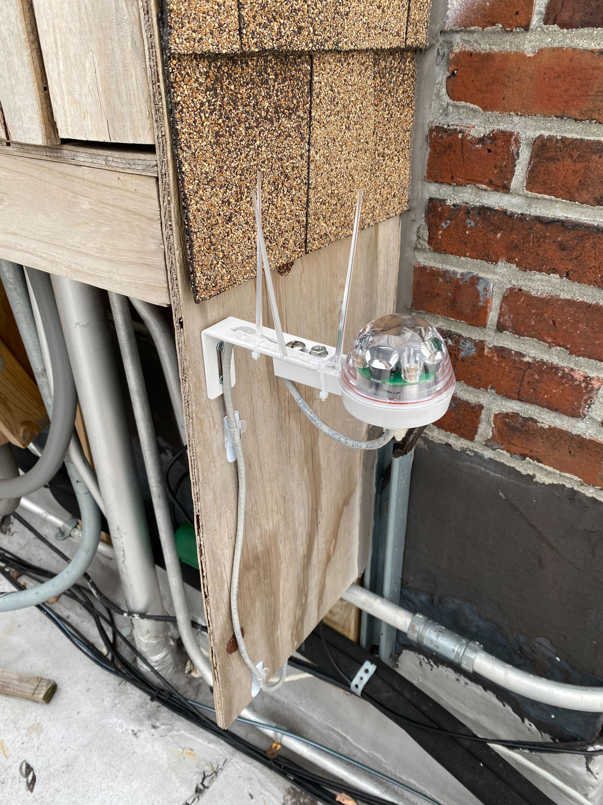

# FloodNet gateway setup
## Introduction

This repository houses all the setup and deployment information for the FloodnNet project's LoRaWAN gateways. Gateway hardware and setups are in flux so could change at any time. We will try and keep this repo up to date buts its advisable to contact info@floodnet.nyc before starting a setup or install in case there are changes to make.

## Summary of deployment needs
A FloodNet sensor gateway picks up transmissions from our street level flood sensors mounted within around 2 km of the gateway. The gateway can be mounted inside or outside but its 3 foot antenna should be mounted as high as possible outside. Mounting points such as railings or existing vertical poles are needed to ensure the gateway and antenna are securely fastened. The gateway also requires a continuous power source such as a domestic power outlet. It measures 7 x 7 x 2 inches, weighs 1 pound, and consumes around 5 watts of power (similar to a small phone charger). To provide the gateway with an internet connection an easy way to connect the gateway to an internet connected router via ethernet cable is preferred. The data throughput of the device is minimal at around 5 MB/day. The gateway also includes a cellular connection as a backup if no existing wired internet is available.

## Gateway hardware
We are currently trialing the [MikroTik LtAP LTE kit (RRP: $179)](https://mikrotik.com/product/ltap_lte_kit) as it provides an in-built: LTE modem that handles US bands with internal antenna, GPS module with internal antenna, and Wi-Fi with internal antenna. There is a spare PCI-E slot inside the MikroTik LtAP LTE kit which allows you to add a [LoRa concentrator card (RRP: $89)](https://mikrotik.com/product/r11e_lr9) to enable it as a LoRaWAN gateway.

For most installations you will be looking for a high gain antenna (~3ft in length) mounted in an un-occluded spot, as high as possible from the ground and any metal surfaces. This will provide you with more LoRa coverage for your sensors. We have used the [SignalPlus 10dBi antenna (Amazon: $85)](https://www.amazon.com/gp/product/B0927J1DCX) which feels solid, provides decent coverage, and comes with 32ft of rugged looking RG58 antenna cable.

* NB1: never power up the gateway without the antenna plugged in, it can fry the LoRa board!
* NB2: always ground yourself properly when touching these LoRa cards as they are sensitive to static shock

## Gateway power consumption
We have measured the power consumption of the MikroTik LtAP LTE gateway at 5W when running the: LTE module, Wi-Fi, GPS and LoRa module. Its normally powered using a 19V supply that draws around 400mA. We use a POE injector to push 24V up CAT5 cabling that can run upto 50ft without an issue of voltage drop.

## Internet backhaul
A LoRaWAN gateway needs an internet connection to forward LoRa packets up to network providers such as [The Things Industries](https://www.thethingsindustries.com), which we use for this project. Internet connectivity via Ethernet is recommended for stability with cellular connectivity as a backup. In some cases the ethernet option may not be available so cell can be used but expect more latency when connecting to the gateway remotely.

We have a cell only gateway deployed in Red Hook that uses an [Embedded Works 64kbps unlimited SIM (RRP: $48/12months)](https://www.embeddedworks.net/wsim4827). This can handle the LoRaWAN traffic easily within its throttled 64kbps bandwidth. One downside is that its only valid for 12 months so would need annual subscription updates.

## Adding Quectel EC25-A LTE modem
TODO

## Adding Mikrotik R11e-LR9 LoRa concentrator
TODO

## Gateway mod to power Hydreon RG-15 rain gauge
To provide power to the rain gauge the LtAP router must be modded to allow power to flow out of the square automotive `PWR` pin. Usually when powering the router via PoE or the barrel jack, this voltage runs through a set of diodes to block any return voltage flowing through the other power input ports, in this case the automotive port. We want to bypass this diode to allow power to flow. This means that you *cannot* input power using the automotive port *and* any of the other power input ports as this will damage the router and your power source. 


You will need to remove all six rear screws on the back plate of the router and carefully lift the top (non port side) up, leaving the port side of the housing close to the ports as the cellular antenna cable routing forces this motion. Then solder a small bridge wire across `D108` located nearby the automotive power port. This could be fiddly so an alternative is to remove `D108` and use a jumper wire or solder bridge to connect the two pads. See image above for a completed mod (TODO: add image).

The rain gauge repo contains instructions on how to setup and assemble the Hydreon RG-15 for use with FloodNet (TODO: create and add repo link).

## Watchdog scripts
TODO

## Gateway setup using a Mac
This is setup to: create a secured Wi-Fi network for nearby config if needed, establish an LTE connection, setup GPS, set timezone and NTP servers, create a DHCP server for Wi-Fi access IP allocations, create a DHCP client for the ethernet interface, set DNS servers to Google defaults, setup LoRaWAN servers for US use, and create a watchdog that restarts the device if a ping times out after 10 minutes to 8.8.8.8.

The [setup file can be found here](config/confscript.rsc). We have used macs to set these up so use the [WinBox for Mac port](https://github.com/nrlquaker/winbox-mac).

1. Insert SIM card in slot 2
2. Plug in the Mikrotik LtAP router using the supplied PSU *or* use a 19-30V passive PoE supply
3. Edit the `config/confscript.rsc` script replacing any instances of `<ADMIN-PASSWORD>` (the password used to access the router for config) and `<WIFI-PASSWORD>` (the password used to connect to the router's Wi-Fi network) with your passwords of choice - *NB: DO NOT GIT COMMIT THE `config/confscript.rsc` FILE WITH THESE PASSWORDS INCLUDED*
3. Connect to the router's open Wi-Fi network using the `<WIFI-PASSWORD>` previously chosen
4. Open up a terminal and run the following line by line:
```
cd <dir you store your repos>/floodnet-gateway/config
scp *.npk admin@192.168.88.1: #Copy updated firmware files to router
ssh admin@192.168.88.1 '/system reboot' #Reboot after update
ssh admin@192.168.88.1 '/system routerboard upgrade' #Update RouterBOARD firmware 
ssh admin@192.168.88.1 '/system reboot' #After device is running after previous reboot, repeat to ensure LTE device is recognized
scp confscript.rsc admin@192.168.88.1:flash #Copy config script to flash dir of router
ssh admin@192.168.88.1 '/system reset-configuration run-after-reset=flash/confscript.rsc' #Reset router applying custom config
```
5. Add the gateway on The Things Network using [these instructions](https://www.thethingsindustries.com/docs/gateways/concepts/adding-gateways/)

## Rain gauge setup (TODO IN SEPARATE REPO)

## Power monitoring setup (TODO)

## Example deployment images
### Red Hook






## Deployment equipment list
Every deployment situation is different so the trick is to bring equipment for every eventuality. It is recommended to bring the following which should enable mounting on most available roof infrastructure. This list is likely missing things so please add anything that you need on-site.

### Config
- [ ] Laptop with Winbox installed (charged) & PSU
- [ ] Ethernet patch cable (for debugging)
- [ ] Dongle with USB & ethernet port
- [ ] Fully-charged mobile phone with MikroTik app installed & charger

### Gateway mounting
- [ ] Gateway assembly (pre-configured)
- [ ] 3ft aluminum pole
- [ ] 6ft aluminum pole
- [ ] 2X Pipe to pipe mount (small)
- [ ] 2X Pipe to pipe mount (large)
- [ ] 2X Pipe to pipe mount (right angled)
- [ ] Large diameter hose clamps
- [ ] Small diameter hose clamps
- [ ] Metal band kit inc. tightening/cutting tool and fasteners
- [ ] Masonry screws

### Misc mounting
- [ ] Various L brackets (with holes)
- [ ] Various nut and bolts


### Cabling
- [ ] POE adapter and power cable
- [ ] Outdoor power connector housing (pill box)
- [ ] Outdoor rated CAT5e cable
- [ ] RJ45 connectors
- [ ] Zip-ties
- [ ] Ethernet cable tester
- [ ] Cable stripper
- [ ] Ethernet cable crimper
- [ ] Scissors
- [ ] Cable staples
- [ ] Tape measure

### Tools
- [ ] Hex socket drill bits (3/8” for hose clamps)
- [ ] Philips screwdriver large & small
- [ ] Flathead screwdriver large & small
- [ ] Ratcheting wrench set
- [ ] Electric screwdriver
- [ ] Bit set for electric screwdriver
- [ ] Needle nose pliers
- [ ] Large masonry drill
- [ ] Masonry bits
- [ ] Small electric drill
- [ ] Drill bit set

### Misc
- [ ] Electrical tape
- [ ] Duct tape
- [ ] Rubberized waterproof sealant
- [ ] Red double sided mounting tape
- [ ] Small garbage bag
- [ ] Backpack
- [ ] Community engagement flyers
- [ ] Safety Glasses
- [ ] Thin work gloves
- [ ] Sunblock and hat (in summer)
- [ ] Cold weather apparel (in winter)
- [ ] Water and a snack
- [ ] First aid kit
- [ ] 4 way power strip


------------------------------------------------------------------------------------------------------------------------
Shield: [![CC BY-NC-SA 4.0][cc-by-nc-sa-shield]][cc-by-nc-sa]

This work is licensed under a
[Creative Commons Attribution-NonCommercial-ShareAlike 4.0 International License][cc-by-nc-sa].

[![CC BY-NC-SA 4.0][cc-by-nc-sa-image]][cc-by-nc-sa]

[cc-by-nc-sa]: http://creativecommons.org/licenses/by-nc-sa/4.0/
[cc-by-nc-sa-image]: https://licensebuttons.net/l/by-nc-sa/4.0/88x31.png
[cc-by-nc-sa-shield]: https://img.shields.io/badge/License-CC%20BY--NC--SA%204.0-lightgrey.svg

